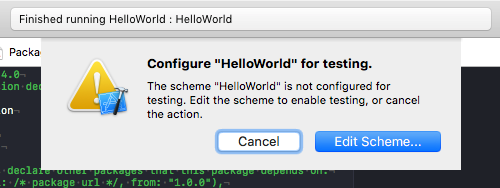
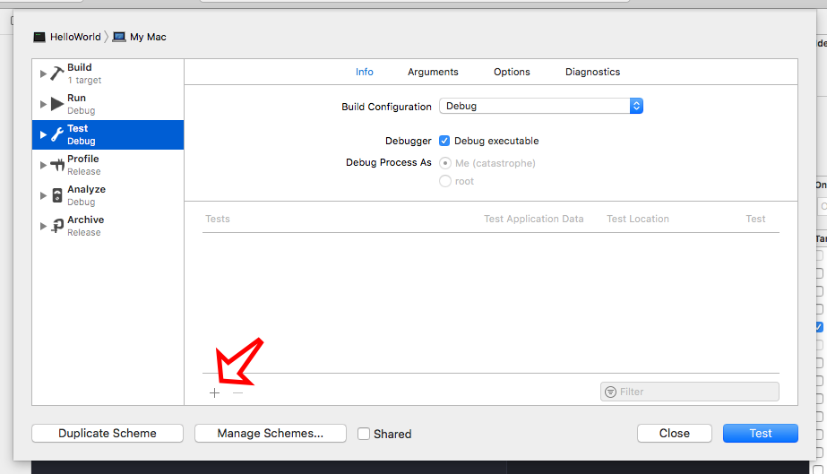
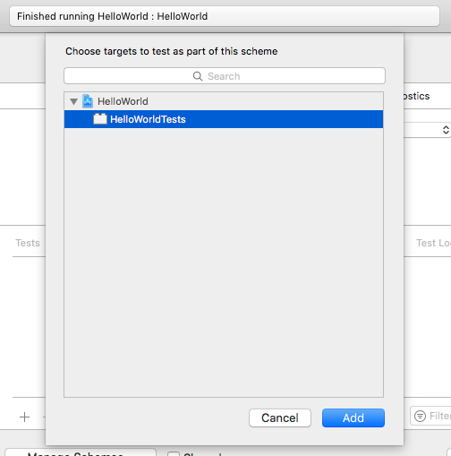

# Midnight Test

Midnight Test is a library to aid in the creation of tests for [Kitura](https://kitura.io)-powered web sites and services. Midnight Test promotes good test-driven development practices by making writing tests for Kitura projects easy, quick, and fun.

## Using Midnight Test

Using Midnight Test will most likely involve changing the way you build your Kitura sites a bit. The general idea is that you add a new target to your project which contains all of your site's logic, including a function to return a built Router object. You then change your "main" target to do nothing but start Kitura using that Router object. You then add a new test target with Midnight Test as a dependency which will also use that Router object to start Kitura while it runs tests.

As an example, let's use the "Hello, World!" example from chapter 1 of [Kitura Until Dawn](https://learnkitura.com), which has a Package.swift file which looks like this:

```swift
// swift-tools-version:4.0
​
import PackageDescription
​
let package = Package(
    name: "HelloWorld",
    dependencies: [
        .package(url: "https://github.com/IBM-Swift/Kitura.git", from: "2.0.0")
    ],
    targets: [
        .target(
            name: "HelloWorld",
            dependencies: ["Kitura"]),
    ]
)
```

And its Sources/main.swift looks like this:

```swift
import Kitura
​
let router = Router()
​
router.get("/") { request, response, next in
    response.send("Hello world!\n")
    next()
}
​
Kitura.addHTTPServer(onPort: 8080, with: router)
Kitura.run()
```

To make this testable, first we'll create another target called HelloWorldApp in Package.swift, and move the dependencies our main HelloWorld target had to HelloWorldApp. We'll then make HelloWorld dependent on HelloWorldApp. The `targets` parameter in our Package.swift now looks like this:

```swift
    targets: [
        .target(
            name: "HelloWorld",
            dependencies: ["HelloWorldApp"]),
        .target(
            name: "HelloWorldApp",
            dependencies: ["Kitura"]),
    ]
```

Now we'll create a new directory in the Sources directory named after our new target, and also create a new Swift file in that directory with the same name, so Sources/HelloWorldApp/HelloWorldApp.swift. (If you're using Xcode, you should now be able to run `swift package generate-xcodeproj` to see this file in your file sidebar.) Inside there, we'll create a new class which includes a method that returns our router logic.

```swift

import Kitura

public class HelloWorldApp {

    public init() {
        // Nothing to do at initialization in this test site, but here you could
        // do things like reading configuration files, connecting to databses,
        // etc.
    }

    public func generateRouter() -> Router {
        let router = Router()

        router.get("/") { request, response, next in
            response.send("Hello world!\n")
            next()
        }

        return router
    }
}
```

Now we'll go back to Sources/HelloWorld/main.swift and change it to look something like:

```swift
import Kitura
import HelloWorldApp

let hello = HelloWorldApp()
let router = hello.generateRouter()

Kitura.addHTTPServer(onPort: 8080, with: router)
Kitura.run()
```

If we now build and run our site, it should run exactly as before.

Now we'll add the test target. Open up Package.swift again and add a dependency to Midnight Test. In the `targets` section, add a `testTarget` which depends on MidnightTest as well as HelloWorldApp. Our Package.swift now looks like this:

```swift
// swift-tools-version:4.0

import PackageDescription

let package = Package(
    name: "HelloWorld",
    dependencies: [
        .package(url: "https://github.com/IBM-Swift/Kitura.git", from: "2.0.0"),
        .package(url: "https://github.com/NocturnalSolutions/MidnightTest.git", from: "0.0.1"),
    ],
    targets: [
        .target(
            name: "HelloWorld",
            dependencies: ["HelloWorldApp"]),
        .target(
            name: "HelloWorldApp",
            dependencies: ["Kitura"]),
        .testTarget(
            name: "HelloWorldTests",
            dependencies: ["HelloWorldApp", "MidnightTest"]),
        ]
)
```

In order to ensure testing works on Linux, we create a file in your empty Tests directory named LinuxMain.swift and give it the following code:

```swift
import XCTest
@testable import HelloWorldTests

XCTMain([
    testCase(HelloWorldTests.allTests)
])
```

Finally, in the Tests directory, create a directory named HelloWorldTests, and create HelloWorldTests.swift inside of it. Now that all that overhead is out of the way, here comes the fun part…

## Writing Tests

The MidnightTestCase class is a subclass of XCTestCase and can be used to define your tests in much the same way. You'll need to override the `setUp()` method and set the `router` property with the Router object for your app, as well as give the `requestOptions`  an array of `ClientRequest.Options` to build a query to your test site. A simple way to do this is to use the `ClientRequest.parse()` method to build such an array out of a URL, though I suggest you check out the code for `ClientRequest.Options` to see what other options you have.

```swift

import HelloWorldApp
import MidnightTest
import KituraNet

class HelloWorldTests: MidnightTestCase {

    public override func setUp() {
        router = HelloWorldApp().generateRouter()
        requestOptions = ClientRequest.parse("http://localhost:8080/")
        super.setUp()
    }
}
```

Now inside your test methods, you'll basically want to call the `testResponse` method or one of its many overrides with at least two parameters: a path, and one or more `ResponseChecker`s. A `ResponseChecker` is a closure which takes two parameters: a `Data` containing the body of the response fetched from the server, and the original `ClientResponse` object that data was extracted from. So let's check to see if the "/" path for our site gives us an HTTP status code of 200 OK, and its body text contains the "Hello world!" message.

```swift
    public func testFrontPage() {
        testResponse("/") { body, response in
            XCTAssertEqual(response.statusCode, HTTPStatusCode.OK, "Unexpected status code found in response.")
            guard let bodyString = String(data: body, encoding: .utf8) else {
                XCTFail("Could not convert response data to String.")
                return
            }
            XCTAssert(bodyString.contains("Hello world!"), "Response body did not contain \"Hello world!\"")
        }
    }
```

Add an `allTests` static var in the HelloWorldTests class which contains a list of all of your test methods. (We only have one for now, but others should have the same format.)

```swift

    public static var allTests = [
        ("testFrontPage", testFrontPage),
    ]
```

Now try running your project tests in the CLI by running `swift test` in the CLI or clicking the Test button in Xcode (see below if Xcode gives you an annoying error message). Your tests should run and (hopefully) pass!

But wait! We can make our test code even shorter, since Midnight Test contains two methods for generating callbacks for checking for HTTP status codes and for body text named `checkStatus()` and `checkString()` respectively. So the above can become:

```swift
    public func testFrontPage() {
        testResponse("/", checker: checkStatus(.OK), checkString("Hello world!"))
    }
}
```

(In the future, I expect Midnight Test will have more of these "generators" for other common tasks like checking for response headers, checking for values in a JSON or XML response, or so on.)

This example just makes a simple GET requests, since that's all our Hello World site supports. But of course Midnight Test supports other types of requests and allows you to specify custom request headers and body data. See the `testResponse` overrides for more. You can also check out the `testPostResponse` function which takes a `[String: [String]?]` of data for performing a POST request and can automatically format it for both multipart and URL encoding.

Have fun!

## Running tests in Xcode

If you're using Xcode and try to run tests through Xcode at this point, you'll get this obnoxious message.



To resolve this, click the "Edit Scheme…" button. On the next sheet, with the "Test" scheme selected in the list on the left and the "Info" tab open, click the little plus icon in the lower left corner as highlighted in the following image.

 

On the next sheet, simply select the "HelloWorldTests" target (it should be the only one in the list) and click the "Add" button.



Then click "Test," and your tests should start running.

## To do
- Add more generators (response header, XML/JSON responses)
- Cover this in KUD
- Adapt [Wastebin](https://github.com/NocturnalSolutions/Wastebin) to use this for its testing
